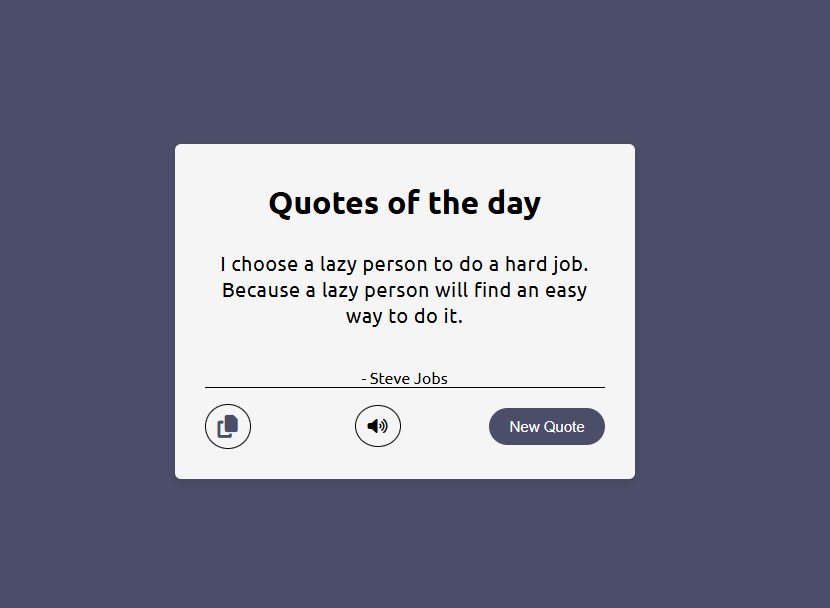

# 📜 Random Quote Generator App

  <!-- Optional: Create a banner image -->

<div align="center">
  
  [](https://yourusername.github.io/quote-generator)
  [](https://github.com/yourusername/quote-generator/stargazers)
  [](https://github.com/yourusername/quote-generator/blob/main/LICENSE)
  
</div>

## 🎯 Project Overview

A beautiful and interactive random quote generator that displays inspirational quotes from famous personalities. Users can generate new quotes, copy them to clipboard, and listen to them using text-to-speech functionality.

  <!-- Add your app screenshot here -->

## ✨ Features

- ✅ **Random Quotes** - Get random quotes from a public API
- ✅ **Copy to Clipboard** - One-click copy functionality
- ✅ **Text-to-Speech** - Listen to quotes with a single click
- ✅ **Responsive Design** - Works perfectly on all devices
- ✅ **Smooth Animations** - Beautiful hover effects and transitions
- ✅ **Toast Notifications** - Visual feedback for copied text

## 🛠️ Technologies Used

| Technology | Purpose |
|------------|---------|
| **HTML5** | Structure and layout |
| **CSS3** | Styling, animations, responsive design |
| **JavaScript (ES6+)** | Functionality and API integration |
| **Font Awesome 6** | Icons (copy, volume) |
| **Web Speech API** | Text-to-speech functionality |
| **DummyJSON API** | Random quote generation |

## 📸 Screenshots

<div align="center">
  
  ### Main Interface
  
  
  ### Copy Functionality
  
  
  ### Mobile View
  
  
</div>

## 🚀 Live Demo

**Check out the live demo:** [Quote Generator App](https://yourusername.github.io/quote-generator)

## 💻 How to Use

### 1️⃣ Generate New Quote
- Click the **"New Quote"** button
- A random quote will appear instantly

### 2️⃣ Copy Quote
- Click the **📋 copy icon**
- A message "Quote copied to clipboard!" will appear
- Paste anywhere (Ctrl+V / Cmd+V)

### 3️⃣ Listen to Quote
- Click the **🔊 volume icon**
- Your device will read the quote aloud
- Works on all modern browsers

## 🎨 Color Scheme

```css
:root {
  --primary-color: #4a4e69;     /* Dark purple-gray */
  --background: whitesmoke;      /* Light gray */
  --text-dark: #333333;          /* Dark text */
  --hover-opacity: 0.5;          /* Hover effect */
}
